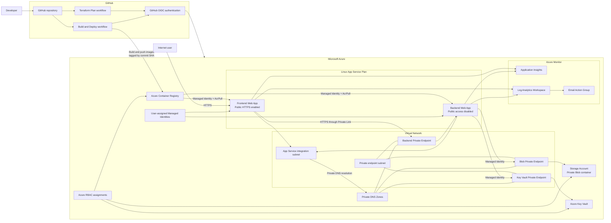

# Azure Production-Ready Platform Architecture

## Architecture overview

This solution deploys a containerized frontend and backend to Azure App Service using Terraform and GitHub Actions.

The frontend is publicly accessible through HTTPS. The backend, Storage Account and Key Vault are protected with private connectivity. Workload access is authenticated with managed identities and Azure RBAC.

## Traffic flow

1. A user accesses the public frontend through HTTPS.
2. The frontend resolves the backend hostname through Azure Private DNS.
3. Traffic reaches the backend through its Private Endpoint.
4. The backend accesses Blob Storage and Key Vault through Private Endpoints.
5. Managed Identity and Azure RBAC are used instead of application secrets.
6. Logs and telemetry are sent to Application Insights and Log Analytics.

## Deployment flow

1. A developer pushes a change to GitHub.
2. Pull requests execute Terraform validation and planning.
3. GitHub authenticates to Azure through OpenID Connect.
4. Docker images are built and tagged using the Git commit SHA.
5. Images are pushed to Azure Container Registry.
6. Azure App Service retrieves the images using managed identities.
7. Terraform deploys or updates the Azure infrastructure.

## Security boundaries

- Only the frontend accepts public application traffic.
- Public network access is disabled for the backend.
- Public network access is disabled for the application Storage Account.
- Public network access is disabled for Key Vault.
- Private DNS Zones resolve the private service endpoints.
- GitHub Actions uses OIDC rather than an Azure client secret.
- App Services use managed identities to access ACR, Storage and Key Vault.
- Azure RBAC grants only the permissions required by each workload.